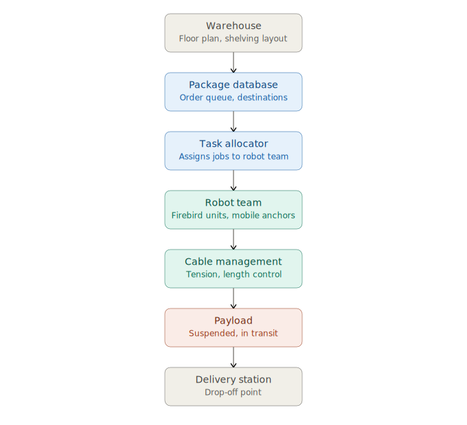

# Warehouse Multi-Agent System

A multi-agent warehouse automation system where multiple mobile robots cooperate to transport packages using a cable-driven payload platform.

Unlike traditional warehouse AGVs that carry loads individually, this project investigates a cooperative cable-driven approach in which several Firebird V ATmega2560 robots act as mobile anchor points for a shared payload.

The project is being developed using ROS 2, Gazebo Harmonic, and Nav2, and will eventually transition to real hardware using ZigBee communication.

> **Project Status:** Active Development 🚧

## System Architecture



## Objectives

- Develop a realistic warehouse simulation
- Design a cooperative cable-driven transport mechanism
- Enable autonomous multi-robot navigation
- Implement task allocation and coordination
- Transition from simulation to Firebird hardware
- Evaluate the system through simulation and hardware experiments, with the goal of research publication

## Technology stack

- Ubuntu 22.04
- ROS 2 Humble
- Gazebo Harmonic
- Nav2
- URDF/Xacro
- SolidWorks
- Git
- Firebird V ATmega2560
- ZigBee

## Development roadmap

- ✅ Phase 0 – Project initialization
- 🔄 Phase 1 – Warehouse simulation
- ⏳ Phase 2 – Autonomous navigation
- ⏳ Phase 3 – Cable-driven payload system
- ⏳ Phase 4 – Warehouse automation system
- ⏳ Phase 5 – Hardware integration & research

## Current status

**Current Version:** v0.1 – Project Foundation

**Completed**
- Project architecture
- Development environment
- Documentation
- Git workflow
- Research planning

**Next milestone**
Warehouse simulation environment

## Current Focus

The current development effort is focused on building a realistic warehouse simulation environment in Gazebo Harmonic that will serve as the foundation for navigation, multi-robot coordination, and the cable-driven payload system.

## Engineering Pipeline

```
Literature Review
        │
        ▼
System Design
        │
        ▼
CAD Modeling
        │
        ▼
URDF/Xacro
        │
        ▼
Gazebo Simulation
        │
        ▼
ROS 2 Integration
        │
        ▼
Nav2 Navigation
        │
        ▼
Multi-Robot Coordination
        │
        ▼
Cable-Driven Payload
        │
        ▼
Hardware Validation
```

## Repository progress

| Version | Milestone | Status |
|---------|-----------|--------|
| v0.1 | Project foundation | ✅ Complete |
| v0.2 | Warehouse environment | 🔄 In progress |
| v0.3 | Firebird robot | ⏳ Planned |
| v0.4 | Autonomous navigation | ⏳ Planned |
| v0.5 | Multi-robot coordination | ⏳ Planned |
| v0.6 | Cable-driven transport | ⏳ Planned |
| v1.0 | Complete system | ⏳ Planned |

## Planned features

- Multi-robot coordination
- Cooperative payload transport
- Cable tension control
- Autonomous navigation
- Dynamic obstacle avoidance
- Warehouse inventory management

## Future Work

- Hardware validation using Firebird V robots
- ZigBee-based multi-robot communication
- Experimental evaluation
- Research paper submission

## Structure

- `Documentation/` — vision, architecture, dev rules, research questions, knowledge base
- `Algorithms/` — task allocation and cable control logic
- `CAD/` — SolidWorks/Fusion 360 files
- `Simulation/` — ROS 2 / Gazebo workspace
- `Hardware/` — Firebird wiring, ZigBee comms notes, BOM
- `Images/`, `Videos/` — media for reports/demos
- `Meetings/` — meeting notes, one file per session
- `References.md` — paper summaries and citations (source PDFs kept local only, not pushed — most are copyrighted)

## Read first

See `Documentation/Project_Vision.md` for what/why, and `Documentation/System_Architecture.md` for the high-level pipeline.

## Contributing

Project currently under active development. Contribution guidelines will be added after v0.5.

## Citation

Citation information will be added upon publication.

## License

TBD

## Development philosophy

This repository is built like an open-source robotics project, not just a code dump. Every milestone should improve documentation alongside code — by v1.0, someone should be able to clone the repo, read the README, follow the docs, launch the simulation, and understand the architecture without asking a single question.
